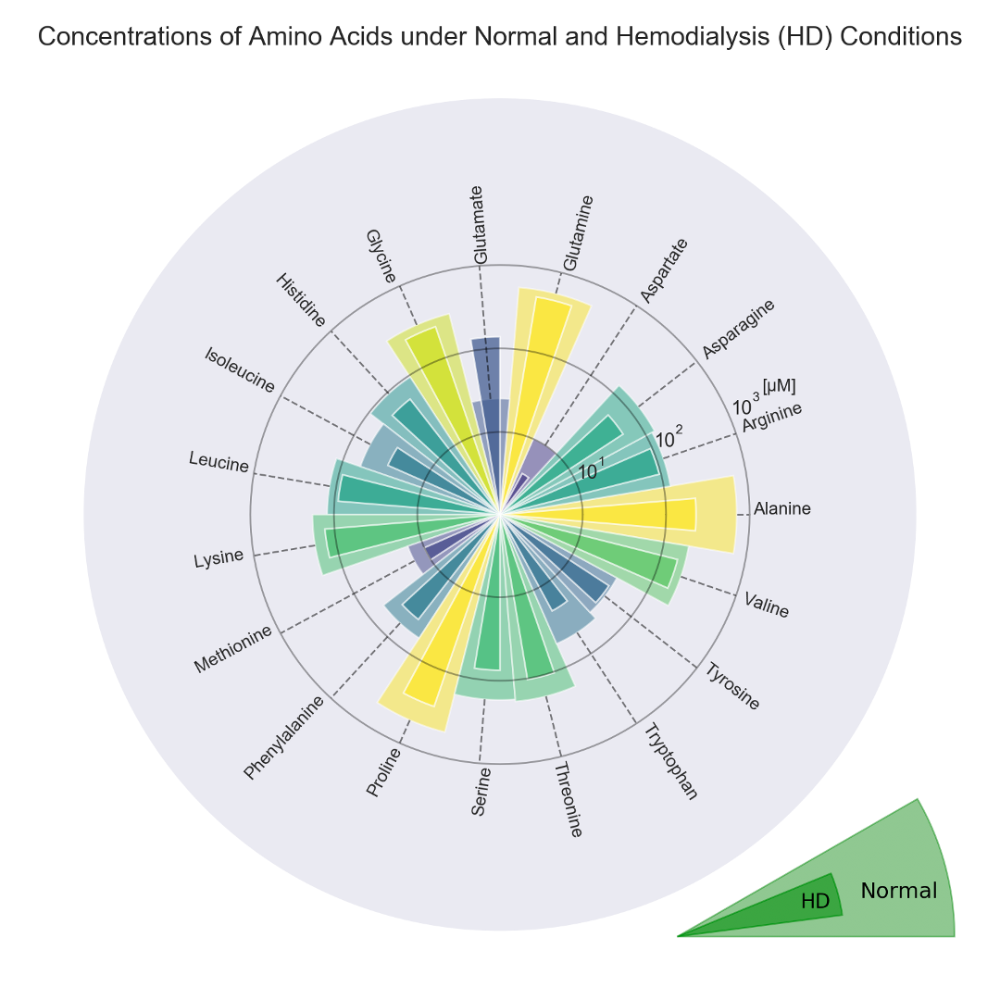

# Amino_acids_polar_plot

More than 2 million End Stage Renal Disease (ESRD) patients worldwide receive dialysis to sustain life. Conventional hemodialysis removes uremic toxins from the body by running ~120 L of dialysate through the dialyzer to clean the blood each session, which is typically 3-4 hours and 3 times a week, which induces abrupt changes to physiological steady states in patients. Many valuable nutrients including amino acids are lost to the single-pass dialysate as well. Traditionally, over 20 different types of serum amino acids concentrations are listed with a page-long table where the features are buried in the data pile.

The proposed solution is an intuitive way of visualizing the most significant trends in the amino acids concentrations before and after hemodialysis. The concentrations are presented using the polar coordinate so that all data could easily fit into the figure. Logarithmic scale is used to present the data spanning over several orders of magnitude. The color for each of the 19 amino acid is set by taking square root of its normal concentration, then divided by 19, in order to differentiate them. After that, a dashed line is added for each entry for labeling. The x-axis labeling is the most labor-intensive process. As the text orientations are out by 180˚ between the left and right part of the figure. Simply setting the text orientation and alignment would not produce the desired figure. The final form of the label was achieved by hand tuning each of the label’s position on the x-axis and on the y-axis based on text length and its quadrant on the polar plot, and also its rotation angle relative to the dashed line.

The legend is drawn separately in another Python file. Inner wedge and outer wedge are used to represent Normal and Hemodialysis (HD) conditions. Textbox background are set to transparent (alpha = 0).

The original data are listed in amino_acid.csv, the main plotting file is polar.py, the legend is plotted with legend.

| File | Description |
| ----------- | ----------- |
| polar.py | main plot |
| legend.py | legend |
| amino_acid.csv | fake data |
| figure.png | finished figure |

